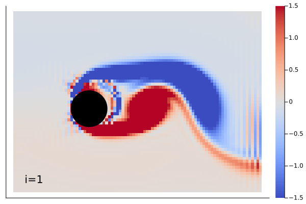
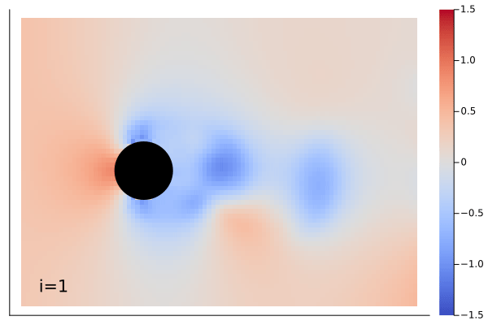

# flow_bench

I checked WaterLily against ViscousFlow simulation performance.

The setup is example flow around a circle from WaterLily

WaterLily: 1.352104 seconds (37.65 k allocations: 4.620 MiB)

ViscousFlow: 14.191539 seconds (9.97 M allocations: 5.499 GiB, 1.21% gc time)

the compilation time happens on every run

comparison of resulting gifs:
### viscous flow:

### waterlily:

